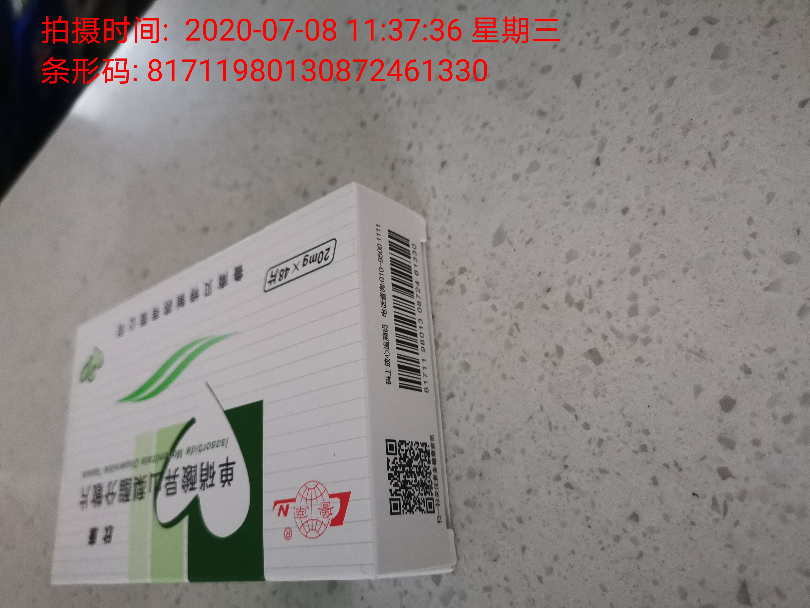

## 说明：

这个项目是在<https://github.com/bertsir/zBarLibary>的基础上做的二次开发， 感谢github用户bertsir的工作。

所以如果想继续改的话， 首先看一下他的github。

## 我主要做了以下修改

1. 在扫描到的二维码/条形码之后，调用相机进行拍照，生成图片。
2. 在图片左上角添加扫描结果以及扫描时间信息，并将保存到手机本地文件中。   

## 具体的：

1. 在QRActivity类中直接获得了camera 对象， 通过在CameraPreview类 以及 CameraManager类中定义的getCamera函数， 获得底层的camera对象。用于拍照操作。
2. 在QRActivity类中定义了 :
   1. 拍照函数 takePicture
   2. 添加文字信息函数  AddTimeWatermark 
3. 在QRActivity类 ScanCallback回调函数中调用takePicture函数， takePicture拍照后，调用AddTimeWatermark添加扫描结果以及扫描时间信息，保存到本地文件中。

## 效果：
这个拍的是药盒， 拍快递单一样的。

  

### 新增功能：

1. 开一个新的线程，对拍摄的照片进行异步存储
2. 在回调函数ScanCallback中， 添加http请求， 请求电脑拍照，实现快递出库设备的功能，一张拍快递， 一张拍人脸。
## 服务器配置
   apache-tomcat-8.5.56   
   windows x64  
   javaSE8
## 服务器用法
服务器的code 和 jar包位于 server 目录下。 包括接收手机拍照文件的tomcat服务器 拍人脸的 人脸服务器。
工作流程：
   1.  使用config.jar 进行配置服务器， 然后开启服务器 
   2.	根据服务器信息设置安卓app，
   3.	手机将拍下来的照片发送给 tomcat 服务器（kuaidi.war），  tomcat 服务器将拍下来的照片进行存储。 
   4. 同时tomcat 服务器向 服务器本机 的拍照服务器(camera.jar)发送请求， 拍照服务器连接摄像机， 拍下人脸照片。
   
   
注： 手机只需连接tomcat 服务器即可 。

如图所示：
   1. 配置服务器信息, 并打开服务器。  服务器需要结合server config 目录下的三个配置文件使用， 将这三个文件放在config文件夹下，config文件夹 放在总路径下。同时将tomcat的版本号信息都删去，将kuaidi.war放在其webapp目录下。 如图所示。
   #### 配置服务器
   

  

   #### 开启服务器（tomcat 服务器后台运行， 不会显示出来， 只有照相服务器有界面）
   
   

  

   #### 服务器的路径设置
   

   

  

   2. 在安卓 配置好服务器信息
   

   

  

   
   3. 服务端拍照
   
   
   #### 快递相片
      

   

  

   #### 人脸相片 
      
   

   

  

   

 

 
